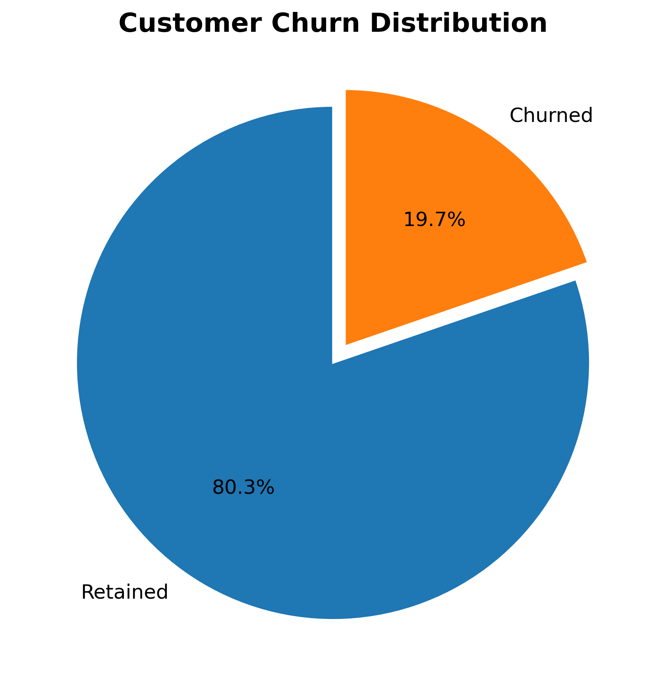
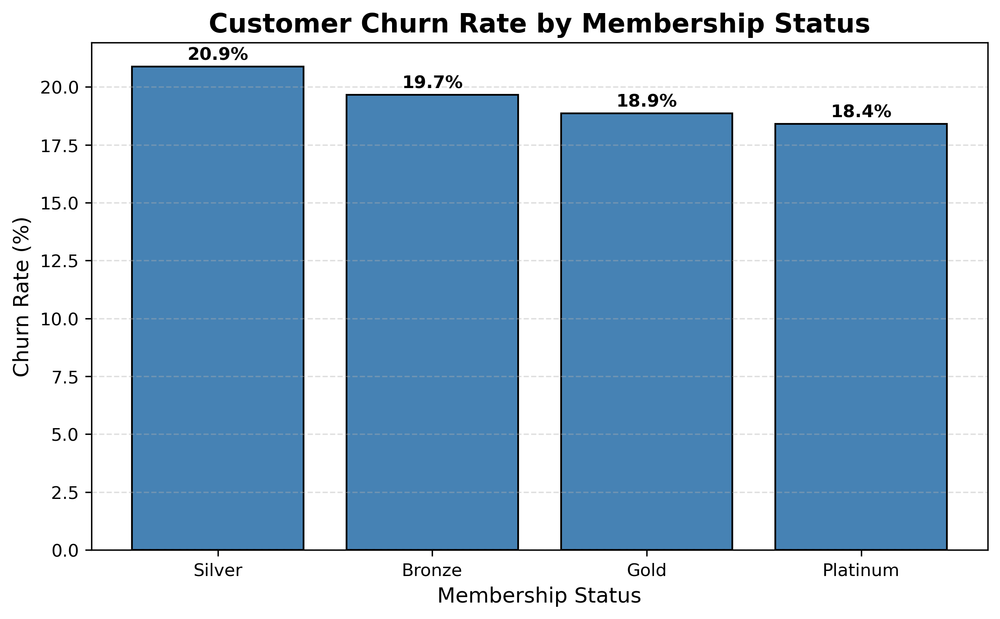
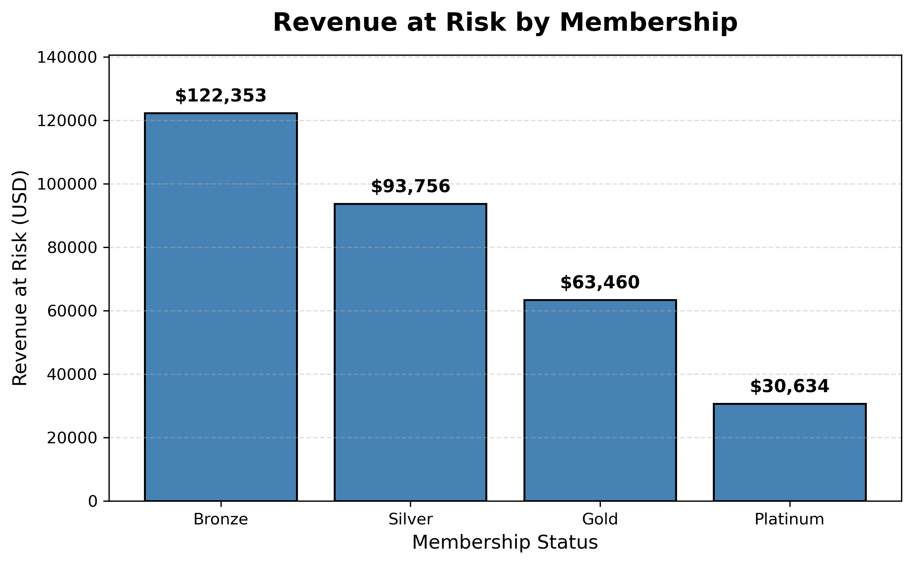

# 📊 Customer Churn Prediction Dashboard

> 🚀 **Live Demo:**  
> https://customer-churn-ml-dashboard.streamlit.app/

> 💻 **GitHub Repository:**  
> https://github.com/harshadajadhav25/customer-churn-project

---

# Project Overview

Customer churn is one of the biggest challenges businesses face because retaining existing customers is significantly more cost-effective than acquiring new ones.

This project develops an end-to-end Machine Learning solution that predicts customer churn using customer demographics, purchasing behavior, engagement metrics, and service-related features.

The project covers the complete data science lifecycle, including:

- Data Cleaning
- Exploratory Data Analysis (EDA)
- Feature Engineering
- Machine Learning Model Development
- Model Evaluation
- Business KPI Analysis
- Interactive Streamlit Dashboard

---

# Live Application

The deployed Streamlit application allows users to:

- Predict customer churn probability
- Calculate a Customer Risk Index
- View Business KPIs
- Explore Business Insights
- Analyze Customer Behavior
- Receive Customer Retention Recommendations

🔗 **Live Dashboard**

https://customer-churn-ml-dashboard.streamlit.app/

---

# Project Structure

```text
customer-churn-project/
│
├── app.py
│
├── models/
│   ├── random_forest_model.pkl
│   ├── scaler.pkl
│   ├── model_features.pkl
│   └── numeric_columns.pkl
│
├── data/
│   └── raw/
│       └── customer_churn.csv
│
├── notebooks/
│   ├── 01_eda_and_data_understanding.ipynb
│   ├── 02_feature_engineering.ipynb
│   ├── 03_model_training_and_evaluation.ipynb
│   └── 04_kpi_analysis_and_business_insights.ipynb
│
├── images/
│   ├── feature_importance.png
│   ├── confusion_matrix.png
│   ├── roc_curve.png
│   ├── churn_distribution.png
│   ├── churn_by_membership.png
│   └── revenue_at_risk.png
│
├── requirements.txt
├── README.md
└── .gitignore
```

---

# Technologies Used

- Python
- Pandas
- NumPy
- Matplotlib
- Scikit-learn
- Streamlit
- Jupyter Notebook

---

# Machine Learning Workflow

- Data Cleaning
- Exploratory Data Analysis
- Feature Engineering
- Feature Scaling
- Model Training
- Model Evaluation
- Business KPI Analysis
- Streamlit Dashboard Development

---

# Machine Learning Models

- Logistic Regression
- Logistic Regression (Balanced)
- Random Forest Classifier
- Random Forest with Threshold Optimization

---

# Model Performance

| Model | Accuracy | Precision | Recall | ROC-AUC |
|-------|---------:|----------:|--------:|--------:|
| Logistic Regression | 0.803 | 0.000 | 0.000 | 0.498 |
| Balanced Logistic Regression | 0.495 | 0.190 | 0.479 | 0.499 |
| Random Forest | 0.803 | 0.000 | 0.000 | 0.518 |
| Random Forest (Threshold = 0.30) | 0.788 | 0.263 | 0.042 | 0.518 |
| Random Forest (Threshold = 0.25) | 0.729 | 0.238 | 0.169 | 0.518 |

---

# Feature Importance

The Random Forest model identified the most influential features contributing to customer churn.

<p align="center">

</p>

---

# Confusion Matrix

The confusion matrix summarizes the classification performance of the model.

<p align="center">

</p>

---

# ROC Curve

The ROC Curve illustrates the trade-off between the True Positive Rate and False Positive Rate across classification thresholds.

<p align="center">

</p>

---

# Business Insights

The KPI analysis converts machine learning predictions into actionable business insights.

## Business KPI Summary

| KPI | Value |
|------|------:|
| Total Customers | **9,000** |
| Overall Churn Rate | **19.73%** |
| High-Risk Customers | **2,277** |
| Revenue at Risk | **$310,203** |
| Average Customer Value Score | **137.03** |

---

## Customer Churn Distribution

Approximately one out of every five customers churned, highlighting a significant customer retention opportunity.

<p align="center">

</p>

---

## Customer Churn Rate by Membership Status

Silver and Bronze membership tiers exhibit the highest churn rates.

<p align="center">

</p>

---

## Revenue at Risk by Membership

Bronze customers contribute the highest amount of potential revenue at risk.

<p align="center">

</p>

---

# Interactive Streamlit Dashboard

The project includes an interactive Streamlit application where users can:

- Predict customer churn probability
- Calculate a Customer Risk Index
- Explore customer risk factors
- View business KPIs
- Review model insights
- Receive retention recommendations

---

# Customer Risk Index

Besides the machine learning prediction, the application calculates a **Customer Risk Index**, which combines:

- Machine Learning Churn Probability
- Customer Engagement Score
- Service Risk Score

This provides a more business-oriented assessment by combining predictive analytics with business-driven customer behavior indicators.

---

# Key Findings

- Approximately **19.7%** of customers churned.
- Customer churn is strongly influenced by behavioral and service-related features.
- Random Forest identified the most influential features affecting churn.
- Bronze and Silver membership tiers exhibited the highest churn rates.
- Bronze customers represented the highest revenue at risk.
- The Customer Risk Index complements machine learning predictions by incorporating engagement and service quality into the final risk assessment.

---

# Business Value

This project demonstrates how machine learning can help organizations:

- Predict customer churn
- Identify high-risk customer segments
- Estimate revenue at risk
- Support customer retention strategies
- Improve customer lifetime value
- Enable data-driven business decisions

---

# Installation

Clone the repository

```bash
git clone https://github.com/harshadajadhav25/customer-churn-project.git
```

Move into the project

```bash
cd customer-churn-project
```

Install the required dependencies

```bash
pip install -r requirements.txt
```

Run the Streamlit application

```bash
streamlit run app.py
```

---

# Future Improvements

- Hyperparameter tuning using GridSearchCV
- Cross-validation
- XGBoost implementation
- LightGBM implementation
- SHAP Explainable AI
- Docker containerization
- Cloud deployment using AWS or Azure
- REST API integration
- Power BI Dashboard integration

---

# Author

**Harshada Jadhav**

GitHub:
https://github.com/harshadajadhav25

Live Demo:
https://customer-churn-ml-dashboard.streamlit.app/