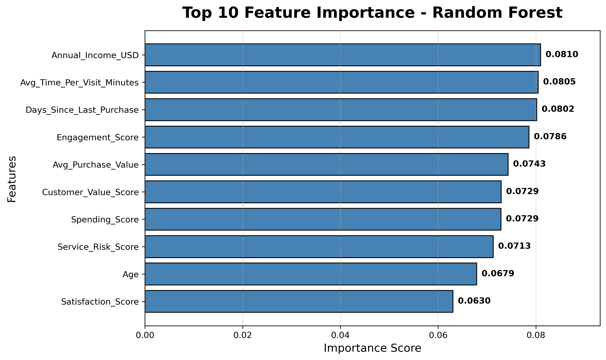
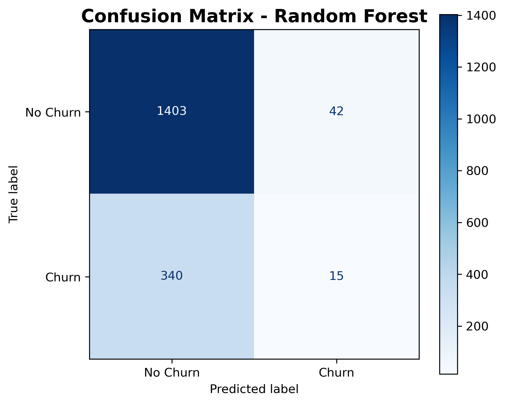
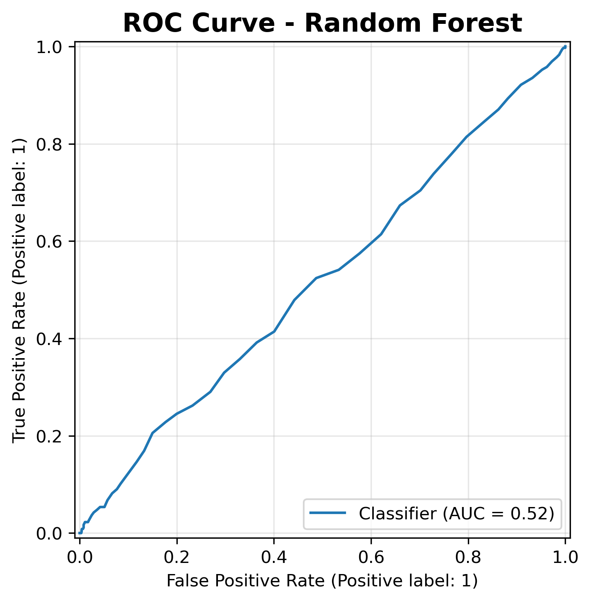

# Customer Churn Prediction using Machine Learning

## Project Overview

Customer churn is a major challenge for businesses because retaining existing customers is often more cost-effective than acquiring new ones. This project develops a machine learning pipeline to predict whether a customer is likely to churn based on customer demographics, purchasing behavior, engagement, and service-related features.

The project covers the complete machine learning workflow, including data preprocessing, feature engineering, exploratory data analysis (EDA), model training, evaluation, and business insights.

---

## Project Structure

```text
customer-churn-project/
│
├── data/
│   └── raw/
│       └── customer_churn.csv
│
├── notebooks/
│   ├── 01_eda_and_data_understanding.ipynb
│   ├── 02_feature_engineering.ipynb
│   ├── 03_model_training_and_evaluation.ipynb
│   └── 04_kpi_analysis_and_business_insights.ipynb
│
├── images/
│   ├── feature_importance.png
│   ├── confusion_matrix.png
│   └── roc_curve.png
│
├── requirements.txt
├── .gitignore
└── README.md
```

---

## Technologies Used

- Python
- Pandas
- NumPy
- Matplotlib
- Scikit-learn
- Jupyter Notebook

---

## Machine Learning Workflow

- Data Cleaning
- Exploratory Data Analysis (EDA)
- Feature Engineering
- Feature Scaling
- Model Training
- Model Evaluation
- Business Insights

---

## Machine Learning Models

- Logistic Regression
- Logistic Regression (Balanced Class Weights)
- Random Forest Classifier
- Random Forest with Threshold Optimization

---

## Model Performance

| Model | Accuracy | Precision | Recall | ROC-AUC |
|-------|---------:|----------:|--------:|--------:|
| Logistic Regression | 0.803 | 0.000 | 0.000 | 0.498 |
| Balanced Logistic Regression | 0.495 | 0.190 | 0.479 | 0.499 |
| Random Forest | 0.803 | 0.000 | 0.000 | 0.518 |
| Random Forest (Threshold = 0.30) | 0.788 | 0.263 | 0.042 | 0.518 |
| Random Forest (Threshold = 0.25) | 0.729 | 0.238 | 0.169 | 0.518 |

---

## Feature Importance

The Random Forest model identified the most influential features contributing to customer churn.

<p align="center">
    
</p>

---

## Confusion Matrix

The confusion matrix summarizes the model's classification performance by comparing predicted and actual customer churn.

<p align="center">
    
</p>

---

## ROC Curve

The ROC Curve illustrates the trade-off between the True Positive Rate and False Positive Rate across different classification thresholds.

<p align="center">
    
</p>

---

## Key Findings

- Class imbalance significantly affected baseline model performance.
- Applying balanced class weights improved churn detection.
- Threshold tuning increased recall for churn prediction while reducing overall accuracy.
- Random Forest identified the most influential features affecting customer churn.
- Model evaluation highlighted the trade-off between precision and recall.

---

## Future Improvements

- Hyperparameter tuning using GridSearchCV
- Cross-validation
- XGBoost and LightGBM implementation
- Model deployment using Flask or Streamlit
- Real-time churn prediction dashboard

---

## Author

**Harshada Jadhav**